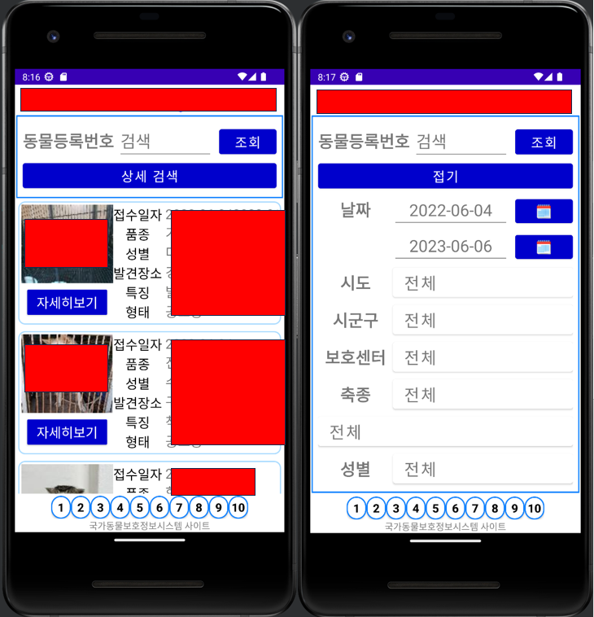

# Music-management-program
삼육대 모바일 프로그래밍 프로젝트

 
 

## 프로젝트 개요
- 프로젝트 이름: 반려동물 정보 어플
- 프로젝트 설명:  
국가동물정보 사이트의 반려동물 정보를 확인할 수 있다. 
날짜, 도시, 종 등을 설정해서 반려동물을 검색할 수 있다. 
반려동물의 상세 정보를 확인할 수 있다.

 
 

## 기술 스택
### Language

### Tools
 

 
 

## 자세한 설명 + 소감
https://stellacode.tistory.com/entry/App-%EB%B0%98%EB%A0%A4%EB%8F%99%EB%AC%BC-%EC%96%B4%ED%94%8C

